# LANFLIX

**Stream any video to everyone on your Wi-Fi.** No accounts, no internet and no app to install.

A host creates a room and drops in a video file. It goes live immediately. Anyone on the same network opens a link in their browser and watches. Viewers can join late and start from the beginning, rewind, skip forward through anything already streamed, jump to live, and close the tab and pick up exactly where they left off.

Under the hood, video segments live in **Redis Streams** and are **pushed** to browsers over a single WebSocket, instead of being **polled** as files the way HLS and DASH work. Every viewer's playback position flows through **Kafka** into a live dashboard and an analytics pipeline.

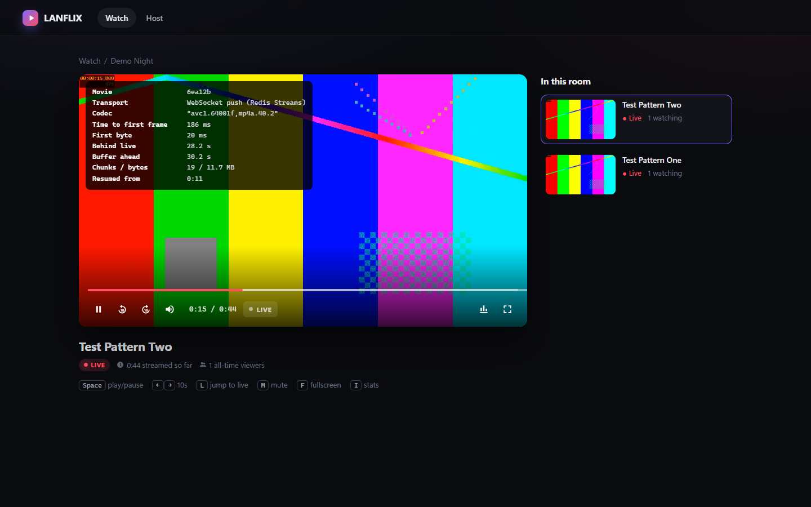

| Landing | Host dashboard | Room |
|---|---|---|
| 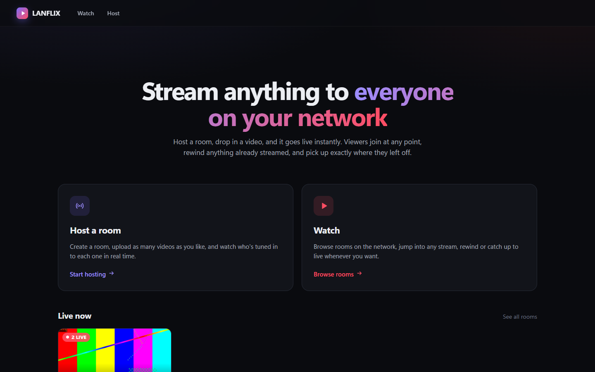 | 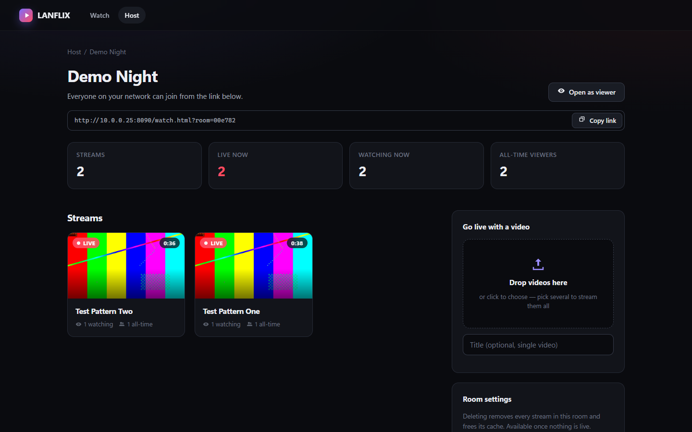 | 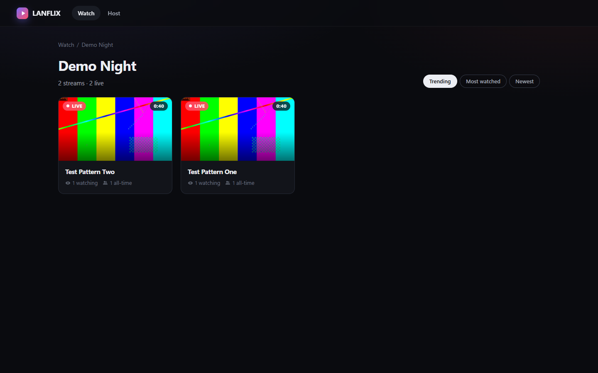 |

## Contents

- [Features](#features)
- [How it works](#how-it-works)
- [Quick start](#quick-start)
- [Watching from other devices on the LAN](#watching-from-other-devices-on-the-lan)
- [API](#api)
- [Benchmark: LANFLIX vs HLS vs DASH vs UDP](#benchmark-lanflix-vs-hls-vs-dash-vs-udp)
- [Reproducing the benchmark](#reproducing-the-benchmark)
- [Bugs the benchmark and testing found](#bugs-the-benchmark-and-testing-found)
- [Limitations](#limitations)
- [Project layout](#project-layout)

## Features

**For hosts**
- Create a room, or reopen one you already have. Room names are unique, so creating "Movie Night" twice takes you back to the same room.
- Drop in one or many videos. Each becomes its own live stream in the room, and any format ffmpeg can read works.
- Per-room dashboard: stream count, live count, viewers watching now, all-time viewers, and a shareable LAN link.
- Delete a stream or a whole room. This frees the Redis cache and the uploaded file.

**For viewers**
- Browse rooms and streams on the network, with auto-generated poster frames.
- Join at the live edge or anywhere earlier. Rewind, skip forward ±10 s, or jump back to live.
- **Resume across sessions.** Close the tab, come back tomorrow, and continue from the same second. The server remembers your position, not the browser.
- "Continue watching" row, room sorting (trending / most watched / newest), keyboard shortcuts, and a stats overlay (`I`) that shows codec, time to first frame, buffer and distance from live.

**For operators**
- Live viewer dashboard on `:8091`, fed by Kafka.
- Analytics consumer that turns the position log into audience retention: how many viewers reached any given point in a stream ("how many made it to minute 12?").

## How it works

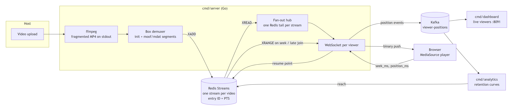

<sub>Diagram source: [docs/architecture.mmd](docs/architecture.mmd) (Mermaid).</sub>

**Ingest.** An uploaded file is saved to `uploads/<id>/` and encoded in real time by ffmpeg into fragmented MP4 (H.264 + AAC, keyframe every 2 s) written to stdout. A Go demuxer in [internal/chunker](internal/chunker/chunker.go) parses MP4 boxes off the pipe. `ftyp+moov` becomes the init segment, and each `moof+mdat` pair becomes one segment. Nothing touches disk.

**Storage.** Each segment is `XADD`ed to the video's Redis Stream with entry ID `<pts_ms>-<seq+1>`. Because the ID *is* the presentation timestamp, Redis doubles as a time index:
- "Start at 12:34" is an `XREVRANGE` to find the segment containing that time, then paged `XRANGE`s forward.
- "Follow live" is a blocking `XREAD`.

**Delivery.** Each viewer holds one WebSocket. The server sends the init segment once, then pushes every segment as a binary message the moment it exists. There are no playlists and no polling.

A fan-out hub keeps **one** Redis tail per live stream, whatever the viewer count. A new viewer subscribes to the hub *before* backfilling history, so no segment can fall into the gap between the two. A viewer that falls more than 64 segments behind is moved off the hub onto its own tail, so a slow client never delays the others.

**Playback.** [web/assets/player.js](web/assets/player.js) reads the exact codec string from the init segment's `avcC`/`mp4a` boxes and appends segments to a MediaSource `SourceBuffer`. When the browser's buffer quota is hit, it evicts already-played media.

**Positions.** Every few seconds the player sends `{"position_ms": …}`. The server writes the viewer's resume point to Redis and publishes the event to Kafka's `viewer-positions` topic. Two independent consumer groups read that topic:
- the dashboard, which shows who is watching what right now
- the analytics service, which builds per-stream retention and can replay history from offset 0

**Liveness.** Each encoding stream refreshes a 10 s heartbeat key. If the server dies mid-stream, the heartbeat expires and the stream is shown as ended instead of "live" forever.

### Why Redis *and* Kafka?

They do different jobs:
- **Redis** is the hot cache that serves video. It gives random access by timestamp and pushes new data within milliseconds.
- **Kafka** is the durable, replayable event log of what viewers did. Adding a new consumer (recommendations, a data warehouse, alerting) means starting a new consumer group and replaying from the beginning, with no change to the server.

## Quick start

**Requirements**
- Go 1.24+
- ffmpeg and ffprobe on `PATH`
- Docker, for Redis and Kafka
- A browser with MediaSource Extensions (Chrome, Edge, Firefox, desktop Safari)

```bash
git clone https://github.com/Preet0504/LANFLIX.git
cd LANFLIX

docker compose up -d                        # Redis :6379, Kafka :9092 (KRaft mode, no ZooKeeper)

go run ./cmd/server    -addr :8090          # web app + API + WebSocket
go run ./cmd/dashboard -addr :8091          # live viewer dashboard (optional)
go run ./cmd/analytics                      # retention analytics (optional)
```

Open **http://localhost:8090**, choose **Host**, name a room and drop in a video. Open the room's link in another tab or on another device to watch.

Run the tests with `go test ./...`.

**Command-line tools**
- `go run ./cmd/producer -input movie.mp4 -movie demo -room cli` ingests a file without the web UI.
- `go run ./cmd/wsclient -addr localhost:8090 -movie demo -from-ms 30000` is a headless viewer, for testing.
- `go run ./cmd/consumer -movie demo` dumps a stream's segments straight from Redis.

## Watching from other devices on the LAN

The server listens on all interfaces. The host dashboard shows the exact link to share, for example `http://192.168.1.20:8090/watch.html?room=…`, using the machine's LAN address.

If other devices can't connect, allow the ports through the host's firewall.

**Windows** (PowerShell as administrator):
```powershell
New-NetFirewallRule -DisplayName "LANFLIX" -Direction Inbound -Protocol TCP -LocalPort 8090,8091 -Action Allow -Profile Private
```
Also make sure the Wi-Fi network is set to **Private**, not Public.

**macOS:** allow incoming connections for the Go binary when prompted.

**Linux (ufw):** `sudo ufw allow 8090,8091/tcp`

Everything works over plain `http://` on a LAN IP. The app deliberately avoids browser APIs that require HTTPS (`crypto.randomUUID`, `navigator.clipboard`).

## API

All endpoints are on the server (`:8090`) unless noted.

| Method | Path | Purpose |
|---|---|---|
| `POST` | `/api/room/create?name=` | Create a room, or return the existing room with that name (`created: false`) |
| `GET` | `/api/rooms` | All rooms, with stream count, live count and poster |
| `GET` | `/api/room?id=` | One room |
| `POST` | `/api/room/delete?id=` | Delete a room and all its streams. Returns `409` while any stream is still live |
| `POST` | `/api/host/start?room=` | `multipart/form-data` with `video` (file) and optional `title`. Returns `{movie_id, title}` |
| `GET` | `/api/movies?room=` | Streams in a room (or all streams if `room` is omitted) |
| `GET` | `/api/movie?id=` | One stream's metadata: status, live edge, duration |
| `POST` | `/api/movie/delete?id=` | Delete a stream: Redis data, analytics and the uploaded file. Returns `409` while it is still live |
| `GET` | `/api/movie/poster?id=` | Poster JPEG |
| `GET` | `/api/resume?movie=&client_id=` | A viewer's saved position |
| `GET` | `/api/continue-watching?client_id=` | A viewer's unfinished streams |
| `GET` | `/api/server-info` | LAN address and port, for share links |
| `GET` | `:8091/api/viewers` | Who is watching what, right now (dashboard service) |

**WebSocket:** `GET /ws?movie=<id>&client_id=<id>[&from_ms=<ms>]`
- Server → client: binary messages. The first is the MP4 init segment. Each after that is one `moof+mdat` media segment, ready for `SourceBuffer.appendBuffer`.
- Client → server: JSON text messages.
  - `{"seek_ms": 754000}` restarts delivery from that time.
  - `{"position_ms": 812345}` reports the playback position.
- If `from_ms` is omitted, the server resumes from this `client_id`'s saved position.

---

## Benchmark: LANFLIX vs HLS vs DASH vs UDP

The full interactive report, with every chart, per-trial data and the method, is in [bench/report/index.html](bench/report/index.html). Open it in a browser. What follows is the summary.

### Setup

To make the comparison fair, **one ffmpeg encoder feeds every system at the same instant with bit-identical frames** (ffmpeg `tee`). Any difference measured is delivery, not encoding.

| | |
|---|---|
| Source | 1280×720, 30 fps, H.264 + AAC, 2 s segments, encoded in real time (`-re`) |
| LANFLIX | Production demuxer → Redis Streams → the real `cmd/server` → the real player |
| HLS | fMP4 segments with an EVENT playlist, pushed by ffmpeg over HTTP PUT into an in-memory origin, played by **hls.js 1.7.3** |
| DASH | fMP4 segments with a dynamic MPD, same origin, played by **dash.js 5.2.1** |
| Tuned variants | HLS with 1-segment live sync; DASH with a 2.5 s live delay. Both are set as aggressively as the players allow for low latency |
| UDP | MPEG-TS over raw UDP, with loss simulated at the receiver (seeded, Bernoulli) |
| Browser | Headless Microsoft Edge (Chromium), a fresh profile for every run |
| Trials | 10 per system, interleaved round-robin so machine drift can't favor any one system |
| Machine | Single laptop: Intel i5-1135G7, 20 GB RAM, Windows 11, everything on localhost |

**Measurements**
- **TTFF**: from telling the player to start until the first frame is actually presented, measured with `requestVideoFrameCallback`.
- **Glass-to-glass delay**: presented frame's wall-clock time minus the moment the encoder produced that frame. The encoder start time is calibrated from the earliest segment across *all* systems.
- **Segment delivery**: from the segment becoming available at the origin until its bytes arrive at the viewer. Available means: for LANFLIX, `XADD` returned; for HLS, listed in the playlist; for DASH, listed in the MPD.

### Results (medians, 10 trials each)

| Metric | **LANFLIX** | HLS | HLS tuned | DASH | DASH tuned |
|---|---|---|---|---|---|
| Time to first frame | **97 ms** | 404 ms | 271 ms | 287 ms | 295 ms |
| Glass-to-glass delay | **2.94 s** | 7.57 s | 3.38 s | 5.06 s | 3.66 s |
| New-segment delivery (median / p95) | **16 ms / 32 ms** | 706 ms / 1.80 s | 984 ms / 1.78 s | 1.22 s / 1.89 s | 1.20 s / 2.07 s |
| Stalls per 15 s of playback | **0** | **0** | 0.4 (4 in one run) | 3.5 | 4.6 |
| HTTP requests per viewer per minute | **2.4** | 242 | 241 | 783 | 198 |
| Seek into history | 70 ms | **26 ms** | 29 ms | 46 ms | 46 ms |
| Segments downloaded per session (4 seeks) | 493 | 76 | 75 | 130 | **18** |

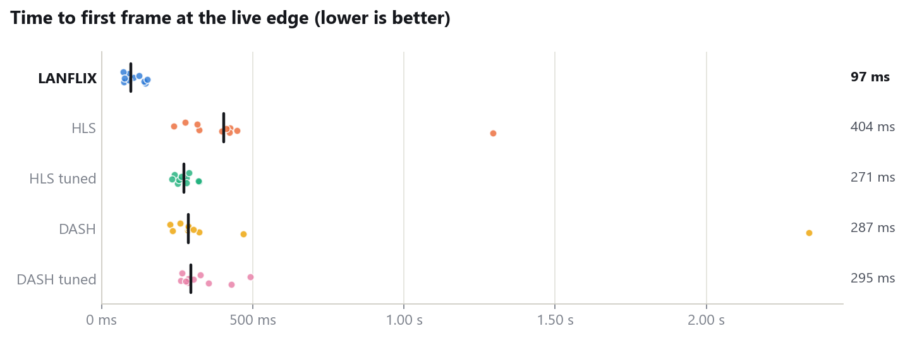
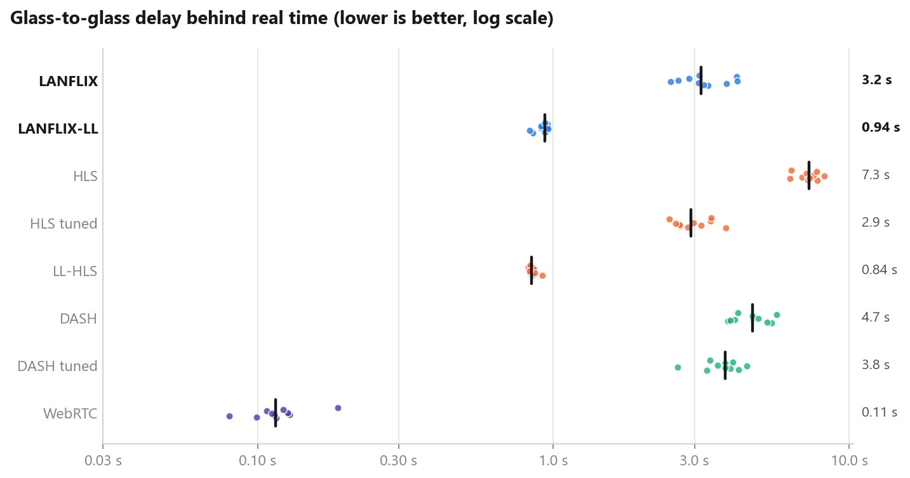
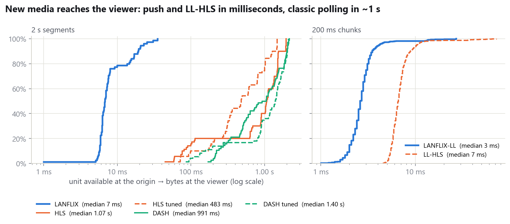
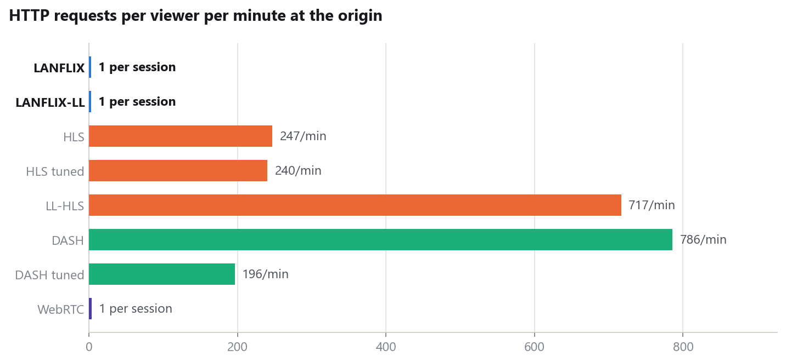

### Where LANFLIX loses

These results are reported as measured.

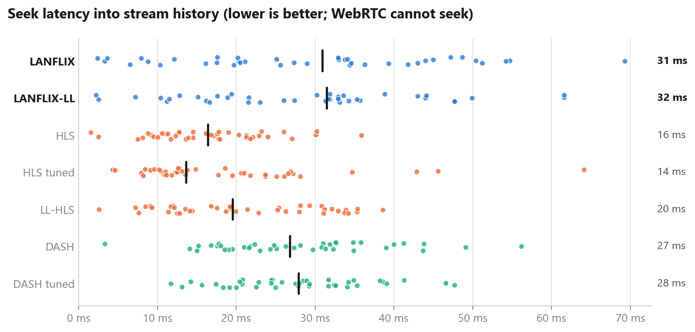

**Seeking is the slowest of all five**: 70 ms against 26 ms for HLS. It also gets slower with each seek in a session: 62 → 78 → 75 → 90 ms. HLS and DASH fetch just the one segment they need over HTTP. LANFLIX restarts a Redis read and has to flush a WebSocket that is already full of pushed data.

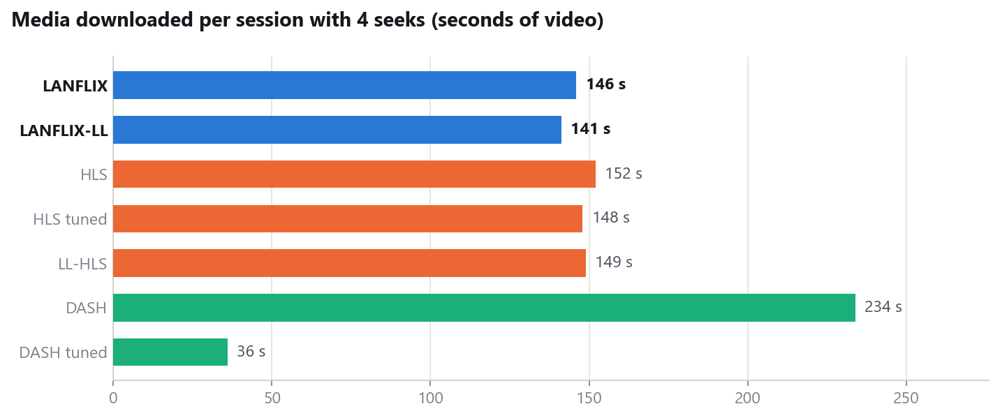

**It wastes bandwidth after a seek.** Push has no brakes: after a seek, the server streams everything from the seek point to the live edge as fast as the socket allows. HLS and DASH stop at roughly 30 s of buffer. On a LAN this is cheap, but on a metered link it would not be.

Both have known fixes that are not implemented yet: client-driven flow control (credit-based push), and sending only one segment on the first page after a seek.

### Scaling (one server, 1 → 200 concurrent viewers)

Every received segment was SHA-256-checked against what was published.

| Viewers | Median delay | p95 | Server CPU (% of one core) | Egress |
|---|---|---|---|---|
| 1 | 4 ms | 17 ms | 0.1 % | 3 Mbps |
| 10 | 6 ms | 15 ms | 0.5 % | 29 Mbps |
| 50 | 24 ms | 35 ms | 3.4 % | 133 Mbps |
| 100 | 43 ms | 117 ms | 5.2 % | 285 Mbps |
| 200 | 89 ms | 230 ms | 12.0 % | 570 Mbps |

Across all steps: **4,196 / 4,196 segment deliveries, 0 hash mismatches, 0 connection failures.**

The first version gave every viewer its own blocking Redis read. At 200 viewers, 81 of them were queued behind the connection pool's limit of 80: median delay was 159 ms and CPU was 31 %. Adding the fan-out hub brought that down to 89 ms and 12 %.

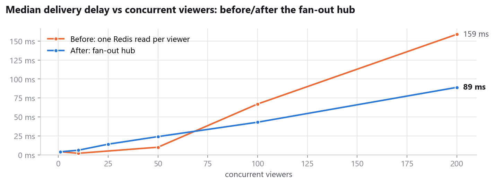
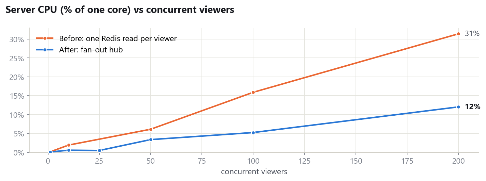

The load generator ran on the same laptop and used about 25 % CPU at n=200, so these numbers are conservative.

### Why not raw UDP?

UDP multicast is the classic LAN answer: one send reaches every viewer. But it has no retransmission, so any lost datagram becomes visible corruption:

| Datagram loss | Continuity errors | Decoder errors | Frames lost |
|---|---|---|---|
| 0 % | 0 | 0 | 0 % |
| 0.1 % | 18 | 13 | 0 % |
| 0.5 % | 103 | 71 | 0.5 % |
| 1 % | 220 | 167 | 1.6 % |
| 2 % | 406 | 279 | 1.7 % |
| 5 % | 948 | 565 | 5.3 % |

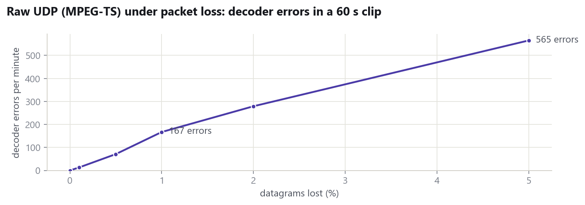

A busy home Wi-Fi network commonly loses 1 % or more of packets. LANFLIX, HLS and DASH all run over TCP, where loss turns into a little delay rather than broken frames. (Loss was not injected into the TCP systems: the benchmark host had no netem equivalent. By design, TCP retransmits instead of dropping.)

UDP also cannot rewind, resume or let anyone join late and start from the beginning.

### Feature comparison

| | **LANFLIX** | HLS | DASH | UDP multicast |
|---|---|---|---|---|
| New segment reaches viewer | ✅ ~16 ms push | ❌ ~0.7–1 s poll | ❌ ~1.2 s poll | ✅ immediate |
| Time to first frame | ✅ 97 ms | 🟡 271–404 ms | 🟡 287–295 ms | 🟡 next keyframe |
| Seek into history | 🟡 70 ms (slowest) | ✅ 26 ms | ✅ 46 ms | ❌ impossible |
| Stalls during playback | ✅ none | 🟡 none by default, rare when tuned | ❌ every run | 🟡 corruption instead |
| Intact under packet loss | ✅ TCP | ✅ TCP | ✅ TCP | ❌ 167 decoder errors/min at 1 % |
| Origin requests per viewer | ✅ 1 socket | ❌ ~240 / min | ❌ 200–780 / min | ✅ none |
| Bandwidth after a seek | ❌ pushes to live edge | ✅ bounded buffer | ✅ bounded buffer | — |
| Join late, watch from start | ✅ | ✅ EVENT playlist | ✅ time-shift window | ❌ |
| Server-side resume across sessions | ✅ | ❌ app must build it | ❌ app must build it | ❌ |
| Per-viewer analytics pipeline | ✅ Kafka | ❌ beacons needed | ❌ beacons needed | ❌ |
| Adaptive bitrate | ❌ | ✅ | ✅ | ❌ |
| CDN / HTTP-cache friendly | ❌ | ✅ | ✅ | ❌ |
| Plays on iPhone | ❌ needs MSE | ✅ native | ❌ needs MSE | ❌ |
| Network egress for N viewers | ❌ N × bitrate | ❌ N × bitrate | ❌ N × bitrate | ✅ 1 × |
| Internet scale | ❌ single origin | ✅ | ✅ | ❌ |

**Summary:** on a LAN, push delivery beats polling on latency, startup and request load, and TCP beats raw UDP on integrity. HLS and DASH remain the right choice for the internet, iPhones, CDNs and adaptive bitrate. None of those are what a single-network streaming app needs.

## Reproducing the benchmark

Additional requirements:
- Node.js with `playwright-core`
- Python 3 with `matplotlib`
- Microsoft Edge, or set `BROWSER_PATH` to a Chromium binary

```bash
# 1. The 3-minute test clip (not committed; regenerate it)
mkdir -p bench/media
ffmpeg -y -f lavfi -i "testsrc2=size=1280x720:rate=30:duration=180" \
          -f lavfi -i "sine=frequency=440:beep_factor=4:duration=180" \
       -c:v libx264 -preset veryfast -crf 23 -pix_fmt yuv420p -c:a aac -b:a 128k -shortest \
       bench/media/source.mp4

# 2. Infrastructure, the real server, and the benchmark origin (one tee'd encoder → all systems, :8095)
docker compose up -d
go run ./cmd/server -addr :8090 &
go run ./bench/source &

# 3. Browser trials (TTFF, latency, delivery, seeks, stalls, requests)
NODE_PATH=/path/to/node_modules node bench/run.js --trials 10

# 4. Load test (pass the server's PID to sample its CPU) and UDP loss test
go run ./bench/load -n 1,10,25,50,100,200 -pid <server-pid>
go run ./bench/udp

# 5. Analysis, README figures and the interactive report
python bench/analyze.py            # → bench/results/summary.json
python bench/figures.py            # → docs/figures/*.png
python bench/report/build.py       # → bench/report/index.html
```

The raw results from the run reported here are in [bench/results/](bench/results/).

## Bugs the benchmark and testing found

Building the benchmark found real bugs in the product. They were fixed before the numbers above were taken:

- **Streams froze after about 8 minutes.** ffmpeg's `\r` progress output grew into a single "line" that exceeded `bufio.Scanner`'s token limit. The stderr reader died, the pipe filled and ffmpeg blocked. Fixed by draining stderr with `io.Copy` into a bounded tail buffer. There is a regression test in [chunker_test.go](internal/chunker/chunker_test.go).
- **200 viewers hit the Redis pool cap.** Each viewer held a blocking `XREAD` connection. Fixed with the fan-out hub (see scaling above).
- **Seeks read the entire history before sending anything.** Fixed with paged `XRANGE`.
- **The codec string was hard-coded to H.264 level 3.0.** It is now parsed from the stream's own `avcC` box.
- **Streams stuck on "live" after a server crash.** Fixed with the heartbeat key.
- **Out-of-order position pings could overwrite a newer resume point with an older one.** Fixed with an ordered, single-writer queue.
- **Resume landed mid-segment and corrupted playback.** Stream IDs were wall-clock times and have been changed to presentation timestamps, and a seek now starts at the segment *containing* the target time.

## Limitations

- **No authentication.** Anyone on the network can host, watch or delete. That is fine for a home network, but not for an office network.
- **Single server.** Redis and the server are single instances. The architecture would shard by stream, but that is not built.
- **One rendition.** There is no adaptive bitrate, so every viewer gets the same 720p stream.
- **Seek speed and post-seek bandwidth**, as described above.
- **iPhone Safari** has no MediaSource Extensions, so it can't play streams. (iPad and desktop Safari can.)
- Uploaded files are kept in `uploads/` until the stream is deleted.

## Project layout

```
cmd/
  server/        web app, REST API, WebSocket delivery, fan-out hub
  dashboard/     live viewer dashboard (Kafka consumer)            :8091
  analytics/     retention analytics (Kafka consumer group)
  producer/      CLI ingest
  wsclient/      headless test viewer
  consumer/      dump a stream from Redis
internal/
  chunker/       ffmpeg → fragmented MP4 box demuxer
  ingest/        encode + publish pipeline, heartbeat
  redisstream/   all Redis data: streams, rooms, resume points, analytics
  positionlog/   Kafka producer/consumer for viewer positions
web/             the app (plain HTML/CSS/ES modules, no build step)
bench/
  source/        benchmark origin: one encoder tee'd to LANFLIX, HLS and DASH
  web/           per-system benchmark player pages (hls.js, dash.js vendored)
  run.js         browser trial runner (Playwright)
  load/          concurrent-viewer load test
  udp/           raw UDP under loss
  analyze.py     raw results → summary.json
  figures.py     summary.json → docs/figures
  report/        interactive benchmark report
  results/       raw data from the reported run
docs/            README figures and screenshots
```
