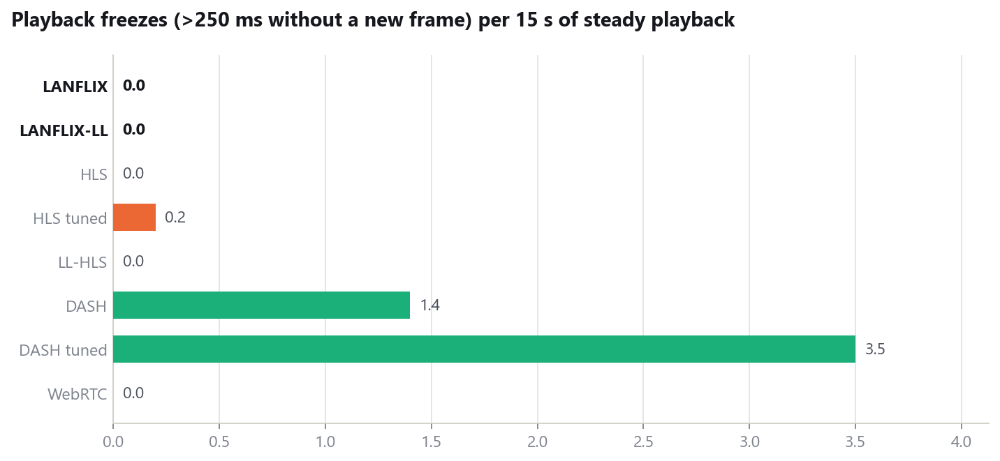

# LANFLIX

**Stream any video to everyone on your Wi-Fi.** No accounts, no internet and no app to install.

A host creates a room and drops in a video file. It goes live immediately. Anyone on the same network opens a link in their browser and watches. Viewers can join late and start from the beginning, rewind, skip forward through anything already streamed, jump to live, and close the tab and pick up exactly where they left off.

Under the hood, video segments live in **Redis Streams** and are **pushed** to browsers over a single WebSocket, instead of being **polled** as files the way HLS and DASH work. Every viewer's playback position flows through **Kafka** into a live dashboard and an analytics pipeline.


| Landing | Host dashboard | Room |
|---|---|---|
|  |  |  |

## Contents

- [Features](#features)
- [How it works](#how-it-works)
- [Quick start](#quick-start)
- [Watching from other devices on the LAN](#watching-from-other-devices-on-the-lan)
- [API](#api)
- [Benchmark: LANFLIX vs HLS, LL-HLS, DASH, WebRTC and UDP](#benchmark-lanflix-vs-hls-ll-hls-dash-webrtc-and-udp)
- [Reproducing the benchmark](#reproducing-the-benchmark)
- [Bugs the benchmark and testing found](#bugs-the-benchmark-and-testing-found)
- [Limitations](#limitations)
- [Project layout](#project-layout)

## Features

**For hosts**
- Create a room, or reopen one you already have. Room names are unique, so creating "Movie Night" twice takes you back to the same room.
- Drop in one or many videos. Each becomes its own live stream in the room, and any format ffmpeg can read works.
- Per-room dashboard: stream count, live count, viewers watching now, all-time viewers, and a shareable LAN link.
- Delete a stream or a whole room. This frees the Redis cache and the uploaded file.

**For viewers**
- Browse rooms and streams on the network, with auto-generated poster frames.
- Join at the live edge or anywhere earlier. Rewind, skip forward ±10 s, or jump back to live.
- **Resume across sessions.** Close the tab, come back tomorrow, and continue from the same second. The server remembers your position, not the browser.
- "Continue watching" row, room sorting (trending / most watched / newest), keyboard shortcuts, and a stats overlay (`I`) that shows codec, time to first frame, buffer and distance from live.

**For operators**
- Live viewer dashboard on `:8091`, fed by Kafka.
- Analytics consumer that turns the position log into audience retention: how many viewers reached any given point in a stream ("how many made it to minute 12?").

## How it works


<sub>Diagram source: [docs/architecture.mmd](docs/architecture.mmd) (Mermaid).</sub>

**Ingest.** An uploaded file is saved to `uploads/<id>/` and encoded in real time by ffmpeg into fragmented MP4 (H.264 + AAC, keyframe every 2 s) written to stdout. A Go demuxer in [internal/chunker](internal/chunker/chunker.go) parses MP4 boxes off the pipe. `ftyp+moov` becomes the init segment, and each `moof+mdat` pair becomes one segment. Nothing touches disk.

**Storage.** Each segment is `XADD`ed to the video's Redis Stream with entry ID `<pts_ms>-<seq+1>`. Because the ID *is* the presentation timestamp, Redis doubles as a time index:
- "Start at 12:34" is an `XREVRANGE` to find the segment containing that time, then paged `XRANGE`s forward.
- "Follow live" is a blocking `XREAD`.

**Delivery.** Each viewer holds one WebSocket. The server sends the init segment once, then pushes every segment as a binary message the moment it exists. There are no playlists and no polling.

A fan-out hub keeps **one** Redis tail per live stream, whatever the viewer count. A new viewer subscribes to the hub *before* backfilling history, so no segment can fall into the gap between the two. A viewer that falls more than 64 segments behind is moved off the hub onto its own tail, so a slow client never delays the others.

**Playback.** [web/assets/player.js](web/assets/player.js) reads the exact codec string from the init segment's `avcC`/`mp4a` boxes and appends segments to a MediaSource `SourceBuffer`. When the browser's buffer quota is hit, it evicts already-played media.

**Positions.** Every few seconds the player sends `{"position_ms": …}`. The server writes the viewer's resume point to Redis and publishes the event to Kafka's `viewer-positions` topic. Two independent consumer groups read that topic:
- the dashboard, which shows who is watching what right now
- the analytics service, which builds per-stream retention and can replay history from offset 0

**Liveness.** Each encoding stream refreshes a 10 s heartbeat key. If the server dies mid-stream, the heartbeat expires and the stream is shown as ended instead of "live" forever.

### Why Redis *and* Kafka?

They do different jobs:
- **Redis** is the hot cache that serves video. It gives random access by timestamp and pushes new data within milliseconds.
- **Kafka** is the durable, replayable event log of what viewers did. Adding a new consumer (recommendations, a data warehouse, alerting) means starting a new consumer group and replaying from the beginning, with no change to the server.

## Quick start

**Requirements**
- Go 1.24+
- ffmpeg and ffprobe on `PATH`
- Docker, for Redis and Kafka
- A browser with MediaSource Extensions (Chrome, Edge, Firefox, desktop Safari)

```bash
git clone https://github.com/Preet0504/LANFLIX.git
cd LANFLIX

docker compose up -d                        # Redis :6379, Kafka :9092 (KRaft mode, no ZooKeeper)

go run ./cmd/server    -addr :8090          # web app + API + WebSocket
go run ./cmd/dashboard -addr :8091          # live viewer dashboard (optional)
go run ./cmd/analytics                      # retention analytics (optional)
```

Open **http://localhost:8090**, choose **Host**, name a room and drop in a video. Open the room's link in another tab or on another device to watch.

Run the tests with `go test ./...`.

**Command-line tools**
- `go run ./cmd/producer -input movie.mp4 -movie demo -room cli` ingests a file without the web UI.
- `go run ./cmd/wsclient -addr localhost:8090 -movie demo -from-ms 30000` is a headless viewer, for testing.
- `go run ./cmd/consumer -movie demo` dumps a stream's segments straight from Redis.

## Watching from other devices on the LAN

The server listens on all interfaces. The host dashboard shows the exact link to share, for example `http://192.168.1.20:8090/watch.html?room=…`, using the machine's LAN address.

If other devices can't connect, allow the ports through the host's firewall.

**Windows** (PowerShell as administrator):
```powershell
New-NetFirewallRule -DisplayName "LANFLIX" -Direction Inbound -Protocol TCP -LocalPort 8090,8091 -Action Allow -Profile Private
```
Also make sure the Wi-Fi network is set to **Private**, not Public.

**macOS:** allow incoming connections for the Go binary when prompted.

**Linux (ufw):** `sudo ufw allow 8090,8091/tcp`

Everything works over plain `http://` on a LAN IP. The app deliberately avoids browser APIs that require HTTPS (`crypto.randomUUID`, `navigator.clipboard`).

## API

All endpoints are on the server (`:8090`) unless noted.

| Method | Path | Purpose |
|---|---|---|
| `POST` | `/api/room/create?name=` | Create a room, or return the existing room with that name (`created: false`) |
| `GET` | `/api/rooms` | All rooms, with stream count, live count and poster |
| `GET` | `/api/room?id=` | One room |
| `POST` | `/api/room/delete?id=` | Delete a room and all its streams. Returns `409` while any stream is still live |
| `POST` | `/api/host/start?room=` | `multipart/form-data` with `video` (file) and optional `title`. Returns `{movie_id, title}` |
| `GET` | `/api/movies?room=` | Streams in a room (or all streams if `room` is omitted) |
| `GET` | `/api/movie?id=` | One stream's metadata: status, live edge, duration |
| `POST` | `/api/movie/delete?id=` | Delete a stream: Redis data, analytics and the uploaded file. Returns `409` while it is still live |
| `GET` | `/api/movie/poster?id=` | Poster JPEG |
| `GET` | `/api/resume?movie=&client_id=` | A viewer's saved position |
| `GET` | `/api/continue-watching?client_id=` | A viewer's unfinished streams |
| `GET` | `/api/server-info` | LAN address and port, for share links |
| `GET` | `:8091/api/viewers` | Who is watching what, right now (dashboard service) |

**WebSocket:** `GET /ws?movie=<id>&client_id=<id>[&from_ms=<ms>]`
- Server → client, binary: the MP4 init segment first, then one `moof+mdat` media chunk per message, ready for `SourceBuffer.appendBuffer`.
- Server → client, text: `{"seek_ack": 754000}` marks where the media for a new position begins (sent on join and after every seek). Binary messages that arrive between a seek and its ack were pushed for the old position, and the player drops them.
- Client → server, text (JSON):
  - `{"seek_ms": 754000}` restarts delivery from the last keyframe at or before that time.
  - `{"position_ms": 812345}` reports the playback position.
- If `from_ms` is omitted, the server resumes from this `client_id`'s saved position.

---

## Benchmark: LANFLIX vs HLS, LL-HLS, DASH, WebRTC and UDP

The full interactive report, with every chart, per-trial data and the method, is in [bench/report/index.html](bench/report/index.html). Open it in a browser. What follows is the summary.

### The short version

- **WebRTC is the latency winner by a wide margin:** 115 ms glass-to-glass, about 7× lower than anything segment-based. It can't rewind, seek or resume, though, and a joining viewer waits for the next keyframe.
- **At equal chunk sizes, LANFLIX and LL-HLS are close to parity on latency** (935 ms vs 843 ms, LL-HLS slightly ahead). LANFLIX starts faster (94 ms vs 214 ms to first frame) and uses one socket per viewer instead of about 718 HTTP requests per minute.
- **At 2 s segments, LANFLIX's latency is no better than tuned HLS** (3.16 s vs 2.91 s; the per-trial ranges overlap). What sets latency is chunk size and how far behind live a player starts, not push versus poll. What push does win at 2 s is getting each new segment to the viewer in 7 ms instead of 0.5–1 s, and a first frame in 61 ms instead of about 225 ms.
- **LANFLIX's weaknesses:** seeking is slower than HLS (31 ms vs 16 ms), and it downloads about 5× more media per session, because after a seek the server pushes everything up to the live edge.

An earlier version of this benchmark (5 systems, before the fixes listed below) showed LANFLIX ahead of tuned HLS on latency. That lead was an artifact: each system joined at the same point in the segment cycle on every trial. With joins randomized, it disappeared.

### Setup

To make the comparison fair, **one ffmpeg encoder feeds every system at the same instant with bit-identical video** (ffmpeg `tee`). Any difference measured is delivery, not encoding.

| | |
|---|---|
| Source | 1280×720, 30 fps, H.264 (no B-frames: WebRTC can't carry them, and low-latency live encoders don't use them) + AAC, keyframe every 2 s, encoded in real time |
| **LANFLIX** | 2 s chunks: production demuxer → Redis Streams → the real `cmd/server` → the real player. Joins at the newest chunk |
| **LANFLIX-LL** | Same server and player, fed 200 ms chunks. Joins 0.6 s behind the end of the newest chunk, the same hold-back as LL-HLS. (A benchmark configuration: the app itself still ingests 2 s chunks.) |
| HLS / HLS tuned | 2 s fMP4 segments, EVENT playlist, **hls.js 1.7.3**: defaults (3 segments behind live), then tuned to 1 segment behind live |
| **LL-HLS** | A Low-Latency HLS origin built for this benchmark, fed the *same* 200 ms chunks as LANFLIX-LL. It uses 200 ms parts, blocking playlist reload, preload hints and delta playlist updates. Played by hls.js in `lowLatencyMode` |
| DASH / DASH tuned | 2 s segments, dynamic MPD, **dash.js 5.2.1**: defaults, then a 2.5 s live delay with catch-up |
| **WebRTC** | The same video as RTP, plus Opus audio (WebRTC can't carry AAC), relayed to the browser by [pion](https://github.com/pion/webrtc) with NACK and RTCP. Chrome's default jitter buffer |
| UDP | MPEG-TS over raw UDP, with loss simulated at the receiver (seeded, Bernoulli) |
| Browser | Headless Microsoft Edge (Chromium), a fresh profile for every session |
| Trials | 10 per system, interleaved round-robin, with a seeded random 0–2 s wait before each session so join points are spread across the segment cycle |
| Machine | Single laptop: Intel i5-1135G7, 20 GB RAM, Windows 11, everything on localhost |

**Measurements**
- **Time to first frame (TTFF):** from telling the player to start until the first frame is actually presented (`requestVideoFrameCallback`).
- **Glass-to-glass delay:** presented frame's wall-clock time minus the moment the encoder produced it.
  - The encoder's clock comes from its RTP output, which leaves ffmpeg as soon as each frame is encoded: the 1st percentile of arrival − timestamp over all 55,436 frames.
  - WebRTC frames are mapped onto the same timeline through their RTP timestamps.
  - Sanity check: no 200 ms chunk ever becomes available before its last frame is encoded (1st percentile: +34 ms).
- **New-media delivery:** from a chunk becoming available at the origin until its bytes reach the viewer. "Available" means: `XADD` returned (LANFLIX), listed in the playlist or MPD (HLS, DASH), or servable as a part (LL-HLS).
- **Freezes:** gaps of more than 250 ms between presented frames during steady playback. This is measured from the frames themselves, so it applies to every player, including WebRTC.

### Results (medians, 10 trials each)

| Metric | **LANFLIX** | **LANFLIX-LL** | HLS | HLS tuned | LL-HLS | DASH | DASH tuned | WebRTC |
|---|---|---|---|---|---|---|---|---|
| Time to first frame | 61 ms | 94 ms | 225 ms | 226 ms | 214 ms | 227 ms | 230 ms | 1.06 s |
| Glass-to-glass delay | 3.16 s | 935 ms | 7.30 s | 2.91 s | 843 ms | 4.71 s | 3.81 s | 115 ms |
| New-media delivery, median / p95 | 7 ms / 21 ms | 3 ms / 4 ms | 1.07 s / 1.96 s | 483 ms / 1.48 s | 7 ms / 10 ms | 991 ms / 2.08 s | 1.40 s / 2.06 s | — (per packet) |
| Seek into history | 31 ms | 32 ms | 16 ms | 14 ms | 20 ms | 27 ms | 28 ms | not possible |
| Freezes per 15 s (>250 ms) | 0.0 | 0.0 | 0.0 | 0.2 | 0.0 | 1.4 | 3.5 | 0.0 |
| HTTP requests / min | 1 per session | 1 per session | 247 | 237 | 718 | 750 | 206 | 1 per session |
| Media downloaded / session | 720 s | 738 s | 153 s | 146 s | 148 s | 233 s | 37 s | — |

WebRTC detail: connecting took 374 ms. The rest of its 1.06 s startup is waiting for the next keyframe, because this shared encoder can't answer a new viewer's keyframe request the way a dedicated WebRTC encoder would. Its jitter buffer averaged 56 ms, with no packets lost.


**Why LL-HLS delivers as fast as push:** hls.js requests each part as a *preload hint* before the part exists, and the origin holds that request open until it does. That's push-like delivery built out of HTTP, and it's why LL-HLS matches LANFLIX-LL on delivery (7 ms vs 3 ms). The cost is visible in the requests chart: about 718 HTTP requests per viewer per minute, where LANFLIX uses one socket.




### Where LANFLIX loses


**Seeking** is about twice as slow as HLS (31 ms vs 16 ms). Both are imperceptible, but it's a consistent gap. HLS fetches just the segment it needs; LANFLIX restarts a Redis read and a stream.


**Bandwidth after a seek.** Push has no brakes. After a seek, the server streams everything from that point up to the live edge as fast as the socket allows, about 5× more media than HLS downloads. On a LAN this is cheap. On a metered link it wouldn't be, and it is also what caused two of the bugs below. The fix is client-driven flow control (the player grants the server credit as it plays). It is designed but not built.

### Scaling (one server, 1 → 200 concurrent viewers)

Every received segment was SHA-256-checked against what was published. (The load test predates today's encoder change and seek protocol. The live fan-out path it measures is unchanged apart from a per-write epoch check.)

| Viewers | Median delay | p95 | Server CPU (% of one core) | Egress |
|---|---|---|---|---|
| 1 | 4 ms | 17 ms | 0.1 % | 3 Mbps |
| 10 | 6 ms | 15 ms | 0.5 % | 29 Mbps |
| 50 | 24 ms | 35 ms | 3.4 % | 133 Mbps |
| 100 | 43 ms | 117 ms | 5.2 % | 285 Mbps |
| 200 | 89 ms | 230 ms | 12.0 % | 570 Mbps |

Across all steps: **4,196 / 4,196 segment deliveries, 0 hash mismatches, 0 connection failures.**

The first version gave every viewer its own blocking Redis read. At 200 viewers, 81 of them were queued behind the connection pool's limit of 80: median delay was 159 ms and CPU was 31 %. Adding the fan-out hub brought that down to 89 ms and 12 %.


The load generator ran on the same laptop and used about 25 % CPU at n=200, so these numbers are conservative.

### Why not raw UDP?

UDP multicast is the classic LAN answer: one send reaches every viewer. But raw UDP has no retransmission, so any lost datagram becomes visible corruption:

| Datagram loss | Continuity errors | Decoder errors | Frames lost |
|---|---|---|---|
| 0 % | 0 | 0 | 0 % |
| 0.1 % | 18 | 13 | 0 % |
| 0.5 % | 103 | 71 | 0.5 % |
| 1 % | 220 | 167 | 1.6 % |
| 2 % | 406 | 279 | 1.7 % |
| 5 % | 948 | 565 | 5.3 % |


A busy home Wi-Fi network commonly loses 1 % or more of packets. LANFLIX, HLS and DASH run over TCP, where loss turns into a little delay rather than broken frames. WebRTC also runs over UDP, but it adds retransmission (NACK) and a jitter buffer, which is exactly what raw UDP lacks. Loss was not injected into any of the benchmarked systems: the host had no netem equivalent.

### Feature comparison

| | **LANFLIX** | HLS / LL-HLS | DASH | WebRTC | UDP multicast |
|---|---|---|---|---|---|
| Live latency (measured) | 🟡 0.94 s (200 ms chunks) / 3.2 s (2 s) | 🟡 0.84 s (LL) / 2.9 s (tuned) | ❌ 3.8 s tuned | ✅ 0.12 s | ✅ ~immediate |
| Time to first frame | ✅ 61–94 ms | 🟡 ~220 ms | 🟡 ~230 ms | ❌ 1.06 s (keyframe wait) | 🟡 next keyframe |
| New media reaches viewer | ✅ 3–7 ms push | 🟡 7 ms (LL) / 0.5–1 s | ❌ ~1–1.4 s | ✅ per packet | ✅ immediate |
| Seek into history | 🟡 31 ms | ✅ 14–20 ms | ✅ 27 ms | ❌ impossible | ❌ impossible |
| Freezes in steady playback | ✅ none | ✅ ~none | ❌ 1.4–3.5 per 15 s | ✅ none (no loss) | 🟡 corruption instead |
| Origin load per viewer | ✅ 1 socket | ❌ 240–720 req/min | ❌ 200–750 req/min | ✅ 1 connection | ✅ none |
| Bandwidth after a seek | ❌ pushes to live edge | ✅ bounded buffer | ✅ bounded buffer | — | — |
| Join late, watch from start | ✅ | ✅ EVENT playlist | ✅ time-shift window | ❌ | ❌ |
| Server-side resume across sessions | ✅ | ❌ app must build it | ❌ app must build it | ❌ | ❌ |
| Per-viewer analytics pipeline | ✅ Kafka | ❌ beacons needed | ❌ beacons needed | 🟡 stats API | ❌ |
| Adaptive bitrate | ❌ | ✅ | ✅ | ✅ (encoder adapts) | ❌ |
| CDN / HTTP-cache friendly | ❌ | ✅ | ✅ | ❌ | ❌ |
| Plays on iPhone | ❌ needs MSE | ✅ native | ❌ needs MSE | ✅ | ❌ |
| Network egress for N viewers | ❌ N × bitrate | ❌ N × bitrate | ❌ N × bitrate | ❌ N × bitrate | ✅ 1 × |

**Which to use:**
- **For a live, interactive stream** (a watch party with voice, a camera, a game), use WebRTC.
- **For a LAN library** that people rewind, resume, join late and scrub through, LANFLIX's design fits best: server-side resume, per-viewer analytics, one socket per viewer and the fastest startup. In low-latency mode it matches LL-HLS on latency.
- **For the internet, iPhones or CDNs**, use HLS/LL-HLS.

## Reproducing the benchmark

Additional requirements:
- Node.js with `playwright-core`
- Python 3 with `matplotlib`
- Microsoft Edge, or set `BROWSER_PATH` to a Chromium binary
- Free local ports: 47004 and 47006 (UDP), 47010 (TCP), 8095

```bash
# 1. The 3-minute test clip (not committed; regenerate it)
mkdir -p bench/media
ffmpeg -y -f lavfi -i "testsrc2=size=1280x720:rate=30:duration=180" \
          -f lavfi -i "sine=frequency=440:beep_factor=4:duration=180" \
       -c:v libx264 -preset veryfast -crf 23 -pix_fmt yuv420p -c:a aac -b:a 128k -shortest \
       bench/media/source.mp4

# 2. Infrastructure, the real server, and the benchmark origin
#    (one tee'd encoder → LANFLIX, LANFLIX-LL, HLS, LL-HLS, DASH, WebRTC; serves :8095)
docker compose up -d
go run ./cmd/server -addr :8090 &
go run ./bench/source &              # wait ~50 s so there is stream history to seek into

# 3. Browser trials: 8 systems × 10 trials, ~40 minutes
NODE_PATH=/path/to/node_modules node bench/run.js --trials 10
curl -s "http://localhost:8095/requests?since=0" > bench/results/requests.json

# 4. Load test (pass the server's PID to sample its CPU) and UDP loss test
go run ./bench/load -n 1,10,25,50,100,200 -pid <server-pid>
go run ./bench/udp

# 5. Analysis, README tables and figures, and the interactive report
python bench/analyze.py            # → bench/results/summary.json
python bench/readme_tables.py      # → the results table above
python bench/figures.py            # → docs/figures/*.png
python bench/report/build.py       # → bench/report/index.html
```

The raw results from the run reported here are in [bench/results/](bench/results/).

## Bugs the benchmark and testing found

Building and running the benchmark found real bugs in the product. All were fixed before the numbers above were taken.

**Found while adding WebRTC and LL-HLS**
- **Viewers started up to 2 s further behind than asked.** Chromium clamps a seek past the end of buffered media to that end. With one chunk per GOP, the first chunk always covered the start point, which hid this. With 200 ms chunks, the server starts at the preceding keyframe, and the player landed there instead. Fixed: the player applies a start or seek position once buffered media covers it.
- **Seeks stuck behind stale pushed data: up to 11 s with 200 ms chunks.** After a far-back seek, the previous position's backfill (thousands of chunks) was still queued in the player and in flight on the socket. Fixed with **seek epochs**: the server drops writes from superseded streams and sends a `seek_ack` marker, and the player clears its queue and drops anything before the ack. In the final run, all 80 LANFLIX seeks completed, the slowest in 69 ms. There's a regression test in [epoch_test.go](cmd/server/epoch_test.go).
- **A CPU-burning retry loop: about 30,000 failed appends per second.** When pushed-ahead media filled the browser's buffer quota, the player "freed" an empty range, which retried the append immediately. Fixed: it evicts only what is actually behind the playhead, and otherwise waits.
- **A forward seek after a long backfill froze playback for good.** This was the same clamping as the first bug, hit mid-session. Fixed by the same change.
- **In the benchmark itself:** the encoder clock was first calibrated with a plain minimum, which locked onto frames that ffmpeg releases early at each loop of the source (about 300 ms off). The runner also joined every system at the same point of the segment cycle on every trial. Both were fixed, and the results were re-measured.

**Found earlier**
- **Streams froze after about 8 minutes.** ffmpeg's `\r` progress output grew into a single "line" that exceeded `bufio.Scanner`'s token limit. The stderr reader died, the pipe filled and ffmpeg blocked. Fixed by draining stderr with `io.Copy` into a bounded tail buffer. There's a regression test in [chunker_test.go](internal/chunker/chunker_test.go).
- **200 viewers hit the Redis pool cap.** Each viewer held a blocking `XREAD` connection. Fixed with the fan-out hub (see scaling above).
- **Seeks read the entire history before sending anything.** Fixed with paged `XRANGE`.
- **The codec string was hard-coded to H.264 level 3.0.** It is now parsed from the stream's own `avcC` box.
- **Streams stuck on "live" after a server crash.** Fixed with the heartbeat key.
- **Out-of-order position pings could overwrite a newer resume point with an older one.** Fixed with an ordered, single-writer queue.
- **Resume landed mid-segment and corrupted playback.** Stream IDs were wall-clock times; they're now presentation timestamps. Seeks now start at the last keyframe at or before the target, found through a keyframe index.

## Limitations

- **No authentication.** Anyone on the network can host, watch or delete. That is fine for a home network, but not for an office network.
- **No flow control.** After a seek the server pushes up to the live edge. The player now copes with that (see the bugs above), but it still costs bandwidth and memory.
- **Single server.** Redis and the server are single instances. The architecture would shard by stream, but that is not built.
- **One rendition.** There is no adaptive bitrate, so every viewer gets the same 720p stream.
- **The low-latency mode is benchmark-only so far.** The app ingests 2 s chunks. The server, store and player all handle 200 ms chunks; the upload path doesn't produce them yet.
- **iPhone Safari** has no MediaSource Extensions, so it can't play streams. (iPad and desktop Safari can.)
- **The benchmark ran on one machine over loopback,** with no network loss applied to the TCP systems or to WebRTC.
- Uploaded files are kept in `uploads/` until the stream is deleted.

## Project layout

```
cmd/
  server/        web app, REST API, WebSocket delivery, fan-out hub, seek epochs
  dashboard/     live viewer dashboard (Kafka consumer)            :8091
  analytics/     retention analytics (Kafka consumer group)
  producer/      CLI ingest
  wsclient/      headless test viewer
  consumer/      dump a stream from Redis
internal/
  chunker/       ffmpeg → fragmented MP4 demuxer (per-GOP segments, or sub-GOP fragments with timing and keyframe flags)
  ingest/        encode + publish pipeline, heartbeat
  redisstream/   all Redis data: streams, keyframe index, rooms, resume points, analytics
  positionlog/   Kafka producer/consumer for viewer positions
web/             the app (plain HTML/CSS/ES modules, no build step)
bench/
  source/        benchmark origin: one encoder tee'd to every system; LL-HLS origin (llhls.go), WebRTC relay (webrtc.go)
  web/           per-system benchmark player pages (hls.js, dash.js vendored)
  run.js         browser trial runner (Playwright)
  load/          concurrent-viewer load test
  udp/           raw UDP under loss
  analyze.py     raw results → summary.json
  readme_tables.py  summary.json → the README results table
  figures.py     summary.json → docs/figures
  report/        interactive benchmark report
  results/       raw data from the reported run
docs/            README figures, screenshots, architecture diagram
```
