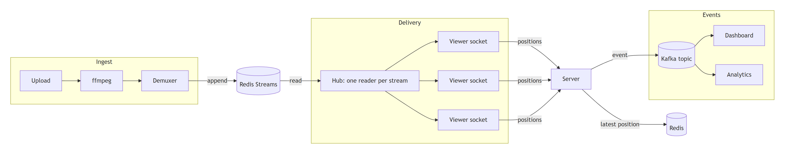

# Chapter 5 — Architecture

This chapter shows the whole system at once: its components, how data flows between them, and the handful of decisions that give it its shape. Chapters 6–12 then take each component in turn.

## 5.1 The components

| Component | What it is | Responsibility |
|---|---|---|
| **Browser (host)** | Web page | Create rooms, upload videos, watch per-stream audience |
| **Browser (viewer)** | Web page with the MSE player | Browse, watch, seek, resume; report position |
| **Server** (`cmd/server`) | One Go process | REST API, uploads, running ffmpeg, WebSocket delivery |
| **ffmpeg** | Subprocess, one per live stream | Encode uploads into fragmented MP4 in real time |
| **Redis** | In-memory data store | Video fragments (Redis Streams), metadata, resume points, indexes |
| **Kafka** | Event log | The stream of "viewer X is at position Y" events |
| **Dashboard** (`cmd/dashboard`) | Separate Go process | Live "who is watching what" view, fed from Kafka |
| **Analytics** (`cmd/analytics`) | Separate Go process | Audience retention, computed from the full event history |

## 5.2 Three flows

A system is easiest to understand by following its data. LANFLIX has three flows, and keeping them separate is the most important architectural decision in it.

**1. The ingest flow: file → fragments.** The host's browser uploads a file. The server writes it to disk while it's still arriving, then starts ffmpeg, which encodes the file in real time into fragmented MP4. A demuxer in the server cuts ffmpeg's output into the init segment and fragments, and appends each fragment to that stream's Redis Stream. *Throughput: one fragment every 2 s (or 200 ms) per stream.*

**2. The delivery flow: fragments → viewers.** A viewer's browser opens a WebSocket. The server sends the init segment, then the fragments from the requested position up to the live edge, then each new fragment as it's appended. One shared reader per stream (the **hub**) fans new fragments out to every viewer watching it, and flow control keeps each viewer at most 30 s ahead of their own playhead. *Throughput: fragments × viewers. This is the hot path.*

**3. The event flow: positions → state and history.** Every 2 s each player reports its position. The server writes the latest position to Redis (so the viewer can resume) and publishes an event to Kafka. The dashboard and the analytics service each consume the Kafka topic independently, at their own pace. *Throughput: 0.5 events per second per viewer; small, but it's history that must be kept.*

Each flow has different needs, which is why they use different tools:

| | Ingest | Delivery | Events |
|---|---|---|---|
| Data | Video bytes | Video bytes | Tiny records |
| Must be | Fast to append | Fast random access by time, instant notification of new data | Durable, replayable, readable by many independent consumers |
| Latency sensitivity | High | Highest | Low: seconds are fine |
| Tool | Redis Streams | Redis Streams + in-process fan-out | Kafka (history) + Redis (latest value) |

## 5.3 The five decisions that shape everything

Many small choices follow from a few big ones. Here are the big ones, each with its reasoning, alternatives and cost.

### Decision 1: Normalize at the edge (re-encode every upload)

Every upload is re-encoded into one shape: H.264, a keyframe every 2 s exactly, AAC, fragmented MP4. Everything downstream relies on that shape: chunk *n* is time 2n–2n+2, every standard chunk starts with a keyframe, and the codec is always playable. **Alternative:** stream the original bytes. That's cheaper on CPU but forces every component to handle arbitrary codecs and irregular keyframes. **Cost:** CPU for encoding, one ffmpeg process per live stream.

### Decision 2: The store is a log whose IDs are timestamps

Each stream is one append-only log (a Redis Stream) of fragments. Each entry's ID is **the fragment's timestamp in the video**. So "find where minute 12 starts", "give me everything from minute 12" and "wait for the next fragment" are each one native operation on one data structure. There's no separate index to keep consistent. **Alternatives:** files on disk plus a manifest (the HLS approach), or a key per fragment in a key-value store plus a separate time index. **Cost:** the data lives in memory, so retention must be bounded (chapter 7).

### Decision 3: Push over one long-lived connection per viewer

Viewers don't ask for fragments; the server sends them. One WebSocket carries video down and control messages up. **Alternative:** HTTP polling (HLS/DASH), which works with caches and CDNs but costs discovery delay and hundreds of requests per viewer per minute. **Cost:** push has no natural brake, so the design needs explicit **flow control** (decision 5). It also can't use HTTP caches, which a LAN doesn't need.

### Decision 4: One reader per stream, not per viewer

If every viewer read new fragments from Redis independently, Redis work would grow with the number of viewers, and each blocked read would hold one of a limited pool of connections. Instead, one goroutine per stream reads from Redis and broadcasts to all of that stream's viewers in memory. Redis load then grows with the number of **streams**, not **viewers**. This is the **fan-out** pattern. **Cost:** a slow viewer must never be allowed to hold up the broadcast, so the hub needs a policy for laggards (chapter 8).

### Decision 5: Every buffer is bounded, and the receiver sets the pace

Anything that queues data must have a limit and a policy for when it's reached. The per-viewer hub buffer is bounded (laggards switch to reading on their own). The browser's media buffer is bounded (eviction). And the server never sends a viewer more than 30 s ahead of that viewer's playhead (credit-based flow control). Without this, one viewer seeking to the start of a long stream would receive the entire stream as fast as the network allows. That wastes Wi-Fi capacity everyone shares, and fills a buffer the browser can't hold.

## 5.4 What lives where

A useful exercise for any design is to list every piece of state, where it lives, and who owns it:

| State | Lives in | Written by | Read by | Lifetime |
|---|---|---|---|---|
| Uploaded file | Disk (`uploads/<id>/`) | Server (upload) | ffmpeg | Until the stream is deleted |
| Init segment | Redis string | Ingest | Delivery | Stream lifetime |
| Fragments | Redis Stream per movie | Ingest | Delivery | Retention window (3 h) |
| Keyframe index | Redis sorted set | Ingest | Delivery (seek) | Same as fragments |
| Movie & room metadata | Redis hashes and sets | Server | Server, web app | Until deleted |
| "Still encoding?" | Redis key with 10 s expiry (lease) | Ingest heartbeat | Server | Refreshed every 3 s |
| Latest position per viewer | Redis key (30-day expiry) | Server | Server (resume) | 30 days |
| Position history | Kafka topic | Server | Dashboard, analytics | Kafka retention |
| Who's watching now | Dashboard memory | Dashboard | Web app | Last 10 s of events |
| Furthest point each viewer reached | Redis sorted set | Analytics | Server | Until deleted |
| A viewer's live connection | Server memory | Server | Server | Connection lifetime |

Notice what's **not** in the table: the server keeps no durable state of its own. Restart it and everything that matters is still in Redis and Kafka; viewers reconnect and resume. Keeping the process that handles connections **stateless** is what makes it easy to restart, and it's what would let several copies run side by side (chapter 14).

## 5.5 The request lifecycle, end to end

Following one viewer through one session ties the chapters together:

1. **Browse.** The page calls `GET /api/rooms`, then `GET /api/movies?room=…`. The server reads metadata hashes from Redis.
2. **Open.** The player asks `GET /api/resume?movie=…&client_id=…`. The client ID is a random ID the browser generated once and stored. The server returns the last saved position, or 0.
3. **Connect.** The player opens `ws://server/ws?movie=…&from_ms=…&window_ms=30000`. The server waits until the init segment exists, sends it, and starts a stream generation at `from_ms`.
4. **Backfill.** The server finds the keyframe at or before `from_ms` in the keyframe index, and sends fragments from there, but only up to 30 s ahead of the viewer's playhead.
5. **Follow.** Having caught up to the live edge, the viewer receives each new fragment from the hub as it's appended.
6. **Report.** Every 2 s the player sends `{"position_ms": …, "until_ms": …}`. The server saves the position, publishes it to Kafka and extends the viewer's flow-control window.
7. **Seek.** The player sends `{"seek_ms": …}`. The server starts a new stream generation at that point and marks it with `{"seek_ack": …}`. The player discards anything that was in flight for the old position.
8. **Leave and return.** The socket closes. The resume point is already saved. Tomorrow, step 2 returns it.

## Check your understanding

1. Why are the three flows handled by different tools instead of one? Pick one flow and explain what would go wrong if it used another flow's tool.
2. Decision 4 says Redis work should scale with streams, not viewers. Estimate the number of Redis reads per second for 5 streams and 200 viewers, with and without the hub, at 2 s fragments.
3. The server keeps no durable state. What exactly happens to a viewer when the server restarts mid-stream?
4. Which decision would you revisit first if LANFLIX had to serve viewers over the internet, and why?
