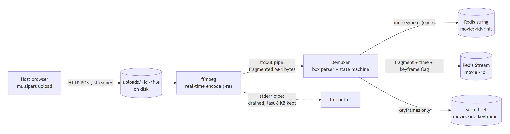

# Chapter 6 — Ingest: from an uploaded file to a live stream

Ingest turns a file a host drops into the browser into a live stream of fragments in Redis. It's a pipeline of four stages: **upload → encode → demux → publish**. Each stage teaches a general lesson about moving data between programs.



## 6.1 Stage 1: receiving the upload without holding it in memory

The host's page sends the file with a standard `multipart/form-data` POST to `/api/host/start?room=<id>`. Multipart is how HTML forms send files: the body is a series of **parts**, each with headers (`Content-Disposition: form-data; name="video"; filename="match.mkv"`) and content. LANFLIX's form has three fields: `title`, an optional `low_latency` flag, and `video`, the file.

A movie file can be several gigabytes. The easy API, "parse the whole form, then give me the file", buffers all of it in memory or a temporary file before your code runs. LANFLIX instead reads the body as a **stream of parts** (Go's `MultipartReader`). As the `video` part arrives, it's copied straight to `uploads/<movie-id>/<filename>` in fixed-size chunks with `io.Copy`. Memory use stays constant no matter how big the file is.

> **Principle: stream, don't slurp.** When data can be arbitrarily large, process it in fixed-size pieces as it arrives. Memory stays constant, and work starts before the transfer ends.

Two safety details:

- **Never trust a client-supplied filename as a path.** A filename like `../../etc/passwd` would escape the upload folder. `filepath.Base` keeps only the final path element.
- **Validate the room before accepting the body.** The server checks that the room exists *before* reading gigabytes, so a bad request fails fast.

## 6.2 Registering before responding

Once the file is on disk, the server:

1. **Registers the movie** in Redis (title, room, status `encoding`, chunk duration). This happens *synchronously, before responding*.
2. Starts two background tasks (goroutines, chapter 12): one encodes, the other extracts a poster frame for the thumbnail.
3. Responds `{"movie_id": "c5d682", "title": "...", "low_latency": true}`.

Why register before responding, when encoding runs in the background anyway? Because the host's page immediately refreshes the room's stream list. If registration happened inside the background task, the list might be fetched *before* the movie was registered, and the new stream would be missing. It's a small race, but a real one.

> **Principle: make a write visible before you acknowledge it.** When you tell a client "done", anything that client reads next should reflect it. This is called read-your-writes consistency.

## 6.3 Stage 2: encoding with ffmpeg as a subprocess

The server runs ffmpeg (the command in chapter 2) as a **child process**, reading the uploaded file at real-time speed (`-re`) and writing fragmented MP4 to its **standard output**, which the server reads through a **pipe**.

A pipe is a small kernel buffer (often 64 KB) between two processes. If the reader stops reading, the buffer fills, and the writer **blocks** on its next write: it simply stops, with no error. A child process has *two* output pipes, standard output and standard error. ffmpeg writes video to stdout and diagnostics to stderr. If the parent only reads stdout, then the moment ffmpeg has written 64 KB of warnings to stderr, it blocks forever, and the stream freezes with no error anywhere.

So the server drains **both** pipes continuously and concurrently:

- stdout goes to the demuxer (stage 3);
- stderr is copied in the background into a **bounded tail buffer** that keeps only the last 8 KB, used for the error message if ffmpeg fails. It's run with `-nostats`, so ffmpeg doesn't write a progress meter forever.

A related ordering rule: all reads from a child's pipes must finish **before** waiting for the child to exit, because waiting closes the pipes.

> **Principle: every producer–consumer channel needs a consumer, always.** A buffer between two parties is a deadlock waiting to happen if either side can stop. Drain every output, and bound anything you keep.

**Why a subprocess rather than a library?** Linking video libraries directly into the server would avoid the process boundary, but ffmpeg as a separate process is simpler, isolates crashes (a malformed input kills ffmpeg, not the server) and is the same tool anyone can run by hand to debug. The price is the pipe discipline above.

## 6.4 Stage 3: demuxing — parsing a byte stream into messages

ffmpeg's stdout is one continuous stream of bytes: the MP4 boxes from chapter 2, back to back. The **demuxer** turns it into discrete messages: one init segment, then fragments.

This is a **framing** problem, the same one every network protocol solves: how do you find message boundaries in a byte stream? MP4 answers it with **length-prefixed** framing. Every box starts with its size, so the reader:

1. reads exactly 8 bytes: a 4-byte size and a 4-byte type;
2. if the size is `1`, reads 8 more bytes of 64-bit "largesize" (for boxes over 4 GB);
3. reads exactly `size − header` more bytes (`io.ReadFull` loops until it has them all or the stream ends);
4. hands `(type, bytes)` to a small **state machine**:

```
            ┌────────────── any box before the first moof ─────────────┐
            ▼                                                          │
     ┌─────────────┐   moof    ┌──────────────┐   mdat    ┌───────────┴──────┐
────►│ collecting  │──────────►│ holding moof │──────────►│ emit fragment =  │──┐
     │ init boxes  │           └──────────────┘           │ moof + mdat      │  │
     └─────────────┘   (on the first mdat, emit the init  └──────────────────┘  │
                        segment = everything collected)          ▲    moof     │
                                                                 └─────────────┘
```

Everything before the first `moof` (that is, `ftyp` and `moov`) is the **init segment**. Each `moof` followed by its `mdat` is one **fragment**. Anything after the end (some muxers append an index box) is ignored.

> **Principle: in binary protocols, never assume a read returns a whole message.** Streams deliver bytes in arbitrary pieces. Use explicit framing (length prefixes or delimiters) and read exactly what the frame says.

## 6.5 Stage 3b: labeling fragments with time and "can start here"

Downstream code needs two facts about each fragment: **where it sits on the timeline** and **whether a decoder can start from it**.

**Standard mode (one fragment per GOP).** ffmpeg starts a fragment at every keyframe, keyframes are forced every 2 s, so fragment *n* covers 2n to 2n+2 seconds and always starts with a keyframe. The labels follow from the position alone: timestamp = n × 2000 ms, keyframe = yes. This works *because* of decision 1 in chapter 5: normalization makes the stream predictable.

**Low-latency mode (200 ms fragments).** Now most fragments start mid-GOP, and position alone says nothing. The demuxer reads the fragment's own metadata (chapter 2.7). In the `moof`, it finds the video track's `traf`:

- **Timeline position** comes from `tfdt` (the decode time of the first frame), converted from track ticks to milliseconds using the track's **timescale** from the init segment's `mdhd` box.
- **Duration** is the sum of the frame durations in `trun`.
- **Keyframe?** comes from the first frame's flags: bit `0x00010000`, "sample is a non-sync sample". If it's clear, the frame is a sync sample, i.e. a keyframe.

Flags and durations follow a **defaults hierarchy**: a value in the `trun` for that frame, otherwise the `tfhd` default for this fragment, otherwise the `trex` default from the init segment. That's a common pattern in compact formats: say a value once where it's shared, override it where it isn't. So the demuxer first parses the init segment to learn each track's ID, type (video or audio), timescale and `trex` defaults.

Low-latency mode also turns off B-frames. Each frame is then displayed in the order it's decoded, so a fragment's decode time *is* its display time, and seeks land exactly where the index says.

## 6.6 Stage 4: publishing, and the stream's lifecycle

Each fragment is appended to the movie's Redis Stream with its timestamp, sequence number and keyframe flag (chapter 7 covers how). The movie's status moves through a simple lifecycle:

```
encoding ──(init segment published)──► live ──(ffmpeg finished or failed)──► ended
```

Viewers who connect in the brief moment between registration and the first init segment are made to **wait briefly** for the init segment rather than being refused. "Not ready yet" and "doesn't exist" are different answers, and conflating them makes fast clients fail.

## 6.7 Liveness: leases instead of promises

What if the server crashes mid-encode? Nothing is left to set the status to `ended`, and the movie would show "Live" forever. A process can't be trusted to announce its own death.

The standard solution is a **lease**, also called a heartbeat with expiry. While encoding, the ingest task sets a Redis key `movie:<id>:alive` with a **10-second expiry**, and refreshes it every **3 seconds**. Readers treat a movie as live only if its status says so *and* the lease key still exists. If the process dies, the key expires within 10 seconds and the movie is automatically treated, and recorded, as ended. The refresh interval (3 s) is well inside the expiry (10 s), so a slow Redis round trip never lets a healthy lease lapse.

> **Principle: detect failure by the absence of a renewed signal, never by the presence of a goodbye.** Leases with expiries are how distributed systems detect dead processes: lock services, leader election, service registries, and here, "is this stream still live?".

## 6.8 Posters

In parallel with encoding, a second ffmpeg process grabs one frame a few seconds into the upload and saves it as a JPEG poster for the room's stream tiles. It's independent of the stream: if it fails, the tile shows a generated placeholder. **Optional work shouldn't sit on the critical path.**

## Check your understanding

1. Why does streaming the upload to disk matter for a 4 GB file? What would the alternative do to the server's memory?
2. Explain precisely how a process can freeze forever because its *error* output wasn't read.
3. Why does MP4 use length-prefixed boxes, and why must the reader loop until it has read the full length?
4. In low-latency mode, why can't the timestamp be computed as `n × 200 ms`? Which box provides it instead?
5. Design question: a lease expires after 10 s and is refreshed every 3 s. What goes wrong if the refresh interval were 12 s? What if the expiry were 10 minutes?
